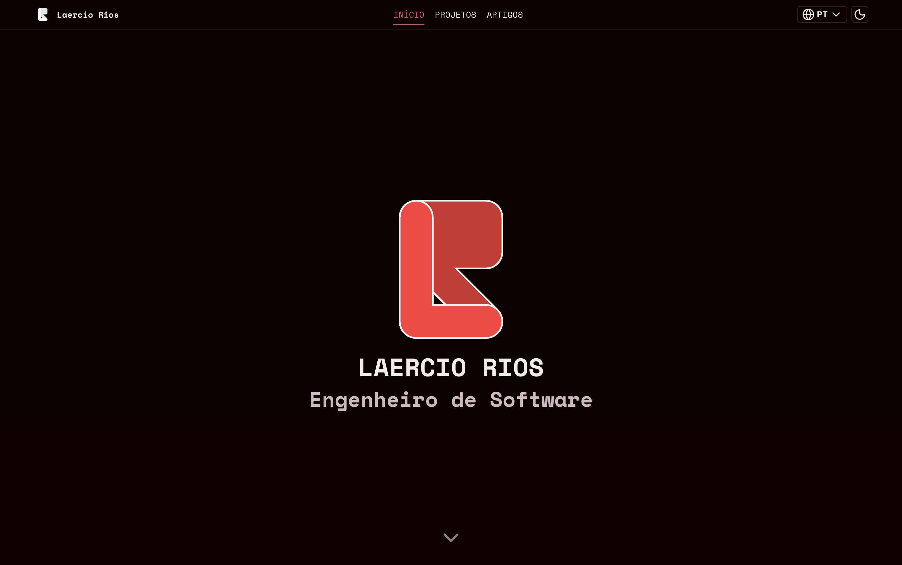

# laerciorios.com

My personal website and portfolio — live at **[laerciorios.com](https://laerciorios.com)**.

Bilingual (English / Portuguese), light and dark themes, and every piece of content
(experiences, formations, projects, talks, articles) written as data or Markdown inside
the repo instead of coming from a CMS.



Design: [Figma community file](https://www.figma.com/community/file/1627672491388184196)

---

## Versions

The site has been rebuilt from scratch a few times, and **every version is still online and
still lives in this repository — each one on its own branch.** `main` always holds the
current version; older versions are kept frozen on their branch and published on a
versioned subdomain.

| Branch | Version | Year | Stack | Live |
| ------ | ------- | ---- | ----- | ---- |
| [`main`](https://github.com/laerciorios/laerciorios.com) | v3 (current) | 2026 | Next.js 16 (App Router), React 19, next-intl, CSS Modules | [laerciorios.com](https://laerciorios.com) |
| [`v3`](https://github.com/laerciorios/laerciorios.com/tree/v3) | v3 | 2026 | same as `main` | [v3.laerciorios.com](https://v3.laerciorios.com) |
| [`v2`](https://github.com/laerciorios/laerciorios.com/tree/v2) | v2 | 2024 | Next.js 14 (App Router), React 18, react-i18next | [v2.laerciorios.com](https://v2.laerciorios.com) |
| [`v1`](https://github.com/laerciorios/laerciorios.com/tree/v1) | v1 | 2023 | Vite, React 18, Styled Components, i18next | [v1.laerciorios.com](https://v1.laerciorios.com) |

So if you are looking for the code of an older layout, don't check the history of `main` —
check out the branch:

```bash
git checkout v1
```

Each branch is self-contained (its own `package.json`, tooling and lockfile), so the setup
steps below apply to `main`/`v3` only. `v2` also runs with `npm run dev`; `v1` is a Vite app
and serves on port `5173`.

---

## Tech stack

- **[Next.js 16](https://nextjs.org/)** with the App Router and Turbopack
- **[React 19](https://react.dev/)** + **TypeScript**
- **[next-intl](https://next-intl.dev/)** for routing and translations
- **[next-themes](https://github.com/pacocoursey/next-themes)** for the light/dark switch
- **CSS Modules** and global CSS custom properties — no CSS framework
- **[react-markdown](https://github.com/remarkjs/react-markdown)** + **gray-matter** for the articles
- **[Vercel](https://vercel.com/)** for hosting, deployed from GitHub Actions

## Getting started

Requires Node.js 20+.

```bash
git clone git@github.com:laerciorios/laerciorios.com.git
cd laerciorios.com
npm install
npm run dev
```

The site runs at <http://localhost:3000>.

| Script | What it does |
| ------ | ------------ |
| `npm run dev` | Development server |
| `npm run build` | Production build |
| `npm run start` | Serve the production build |
| `npm run lint` | ESLint |

There is no test suite.

## Project structure

```
app/
  [locale]/            Localized routes: home, projects, articles, setup,
                       recommendations, minesweeper, 404 and error pages
  [locale]/components/ Home page sections (Hero, About, Experiences, ...)
  components/          Shared UI: Header, Footer, Typography, Badge, icons, markdown
  globals.css          Design tokens for both themes
  robots.ts            robots.txt
  sitemap.ts           Localized sitemap, including articles
data/                  Site content as typed arrays: experiences, formations,
                       projects, talks, recommendations, setup
articles/              Blog posts as Markdown with front matter
i18n/                  next-intl config, request handler and messages (en, pt-BR)
lib/articles.ts        Reads and parses the Markdown articles
public/                Images, CVs, favicon and logo
proxy.ts               next-intl locale routing middleware
openspec/              Change proposals and specs used while building features
```

The path alias `@/*` maps to the repository root.

## Content

Nothing is fetched from a CMS — editing the site means editing the repo:

- **Experiences, formations, projects, talks, recommendations, setup** — typed arrays in
  `data/`. Titles and descriptions are translation keys, so the copy itself lives in
  `i18n/messages/`.
- **Articles** — one Markdown file per post in `articles/`, with `title`, `description`,
  `slug`, `date`, `theme`, `thumbnail` and optional `canonical_url` in the front matter.
  New files are picked up automatically by the articles list and the sitemap.
- **Images** — `public/images/`, grouped by project.

## Internationalization

Locales are `en` (default) and `pt-BR`, declared in `i18n/config.ts`. Routing uses
`localePrefix: "as-needed"`, so English URLs have no prefix and Portuguese ones are served
under `/pt-BR`. Server components read messages with `getLocale()` / `getMessages()` from
`next-intl/server`; client components use `useTranslations("section")`.

## Theming

Both themes are defined as CSS custom properties in `app/globals.css`, under
`[data-theme="light"]` and `[data-theme="dark"]`. `next-themes` sets `data-theme` on the
`<html>` element, and the toggle in the header reads it through `useTheme()`.

## Deployment

Pushing to `main` triggers `.github/workflows/continuous-delivery.yml`, which installs the
dependencies and runs `vercel --prod`. Vercel's own Git integration is disabled for `main`
in `vercel.json` so the two don't deploy twice. The workflow needs `VERCEL_TOKEN`,
`VERCEL_ORG_ID_V3` and `VERCEL_PROJECT_ID_V3` as repository secrets.

`www.laerciorios.com` is permanently redirected to the apex domain in `next.config.ts`.

## Conventions

- Use `git mv` when moving or renaming files, to keep their history.
- Keep client-only interactivity (theme toggle, language switcher, dropdowns, carousels)
  isolated in `"use client"` components.
- Icons are individual components in `app/components/icons/`, re-exported from its
  `index.tsx`.
